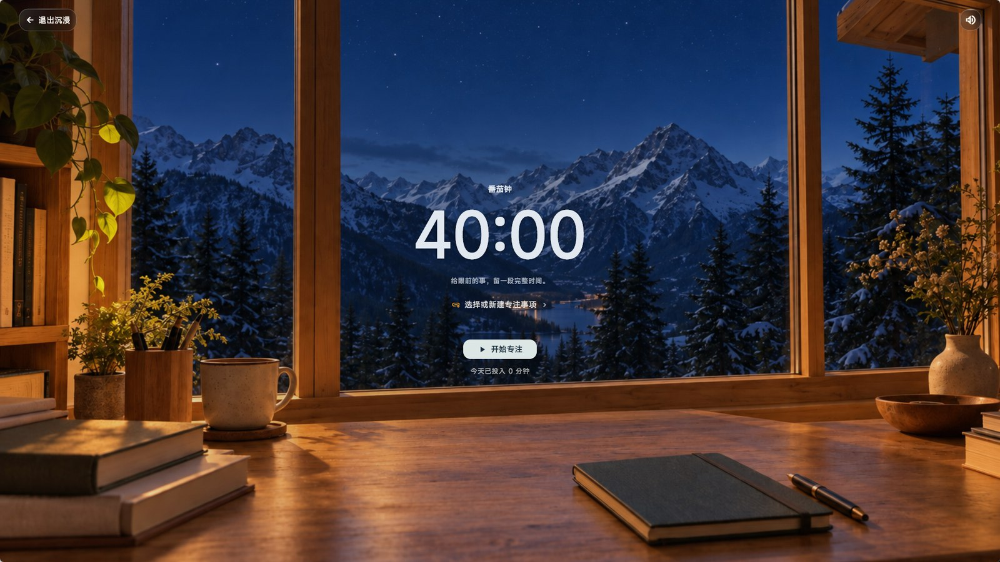
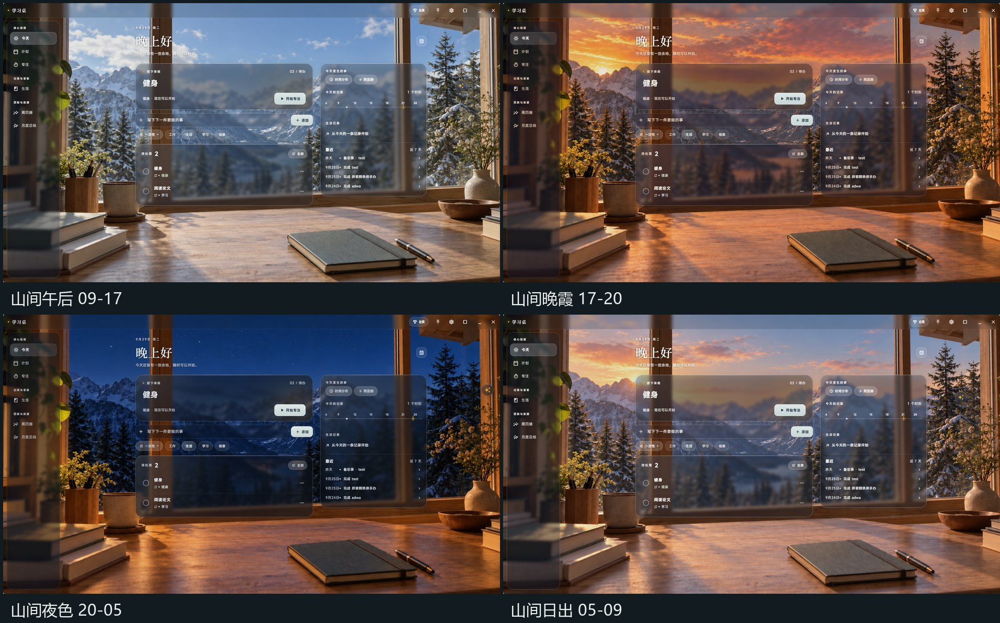
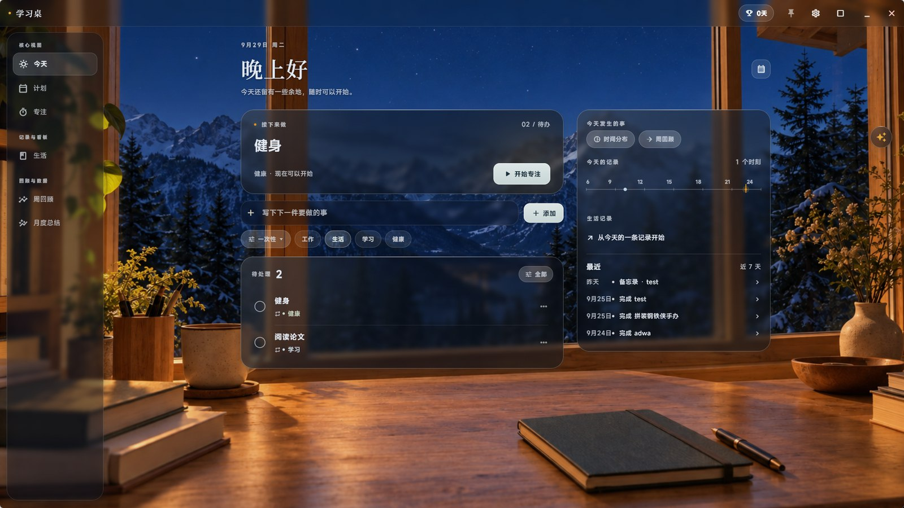
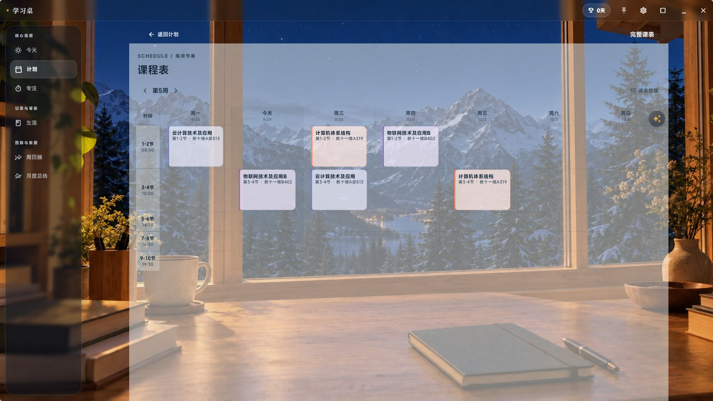
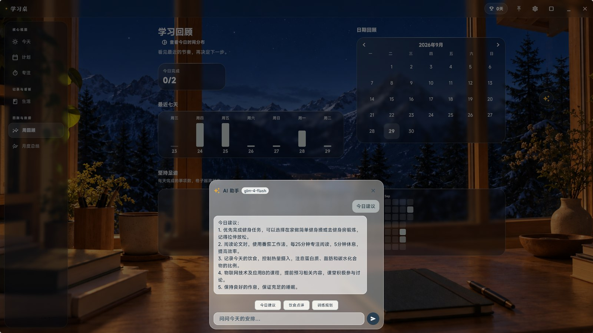
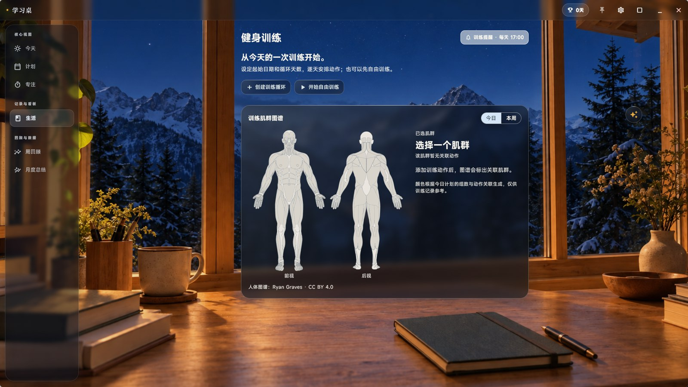
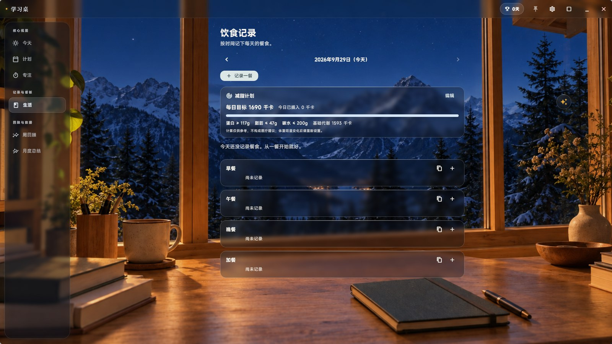
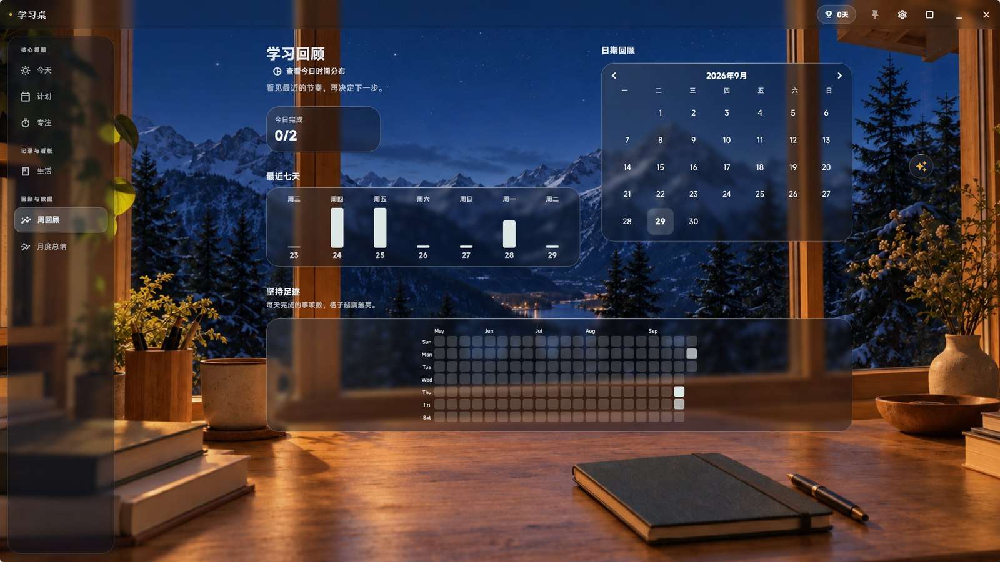
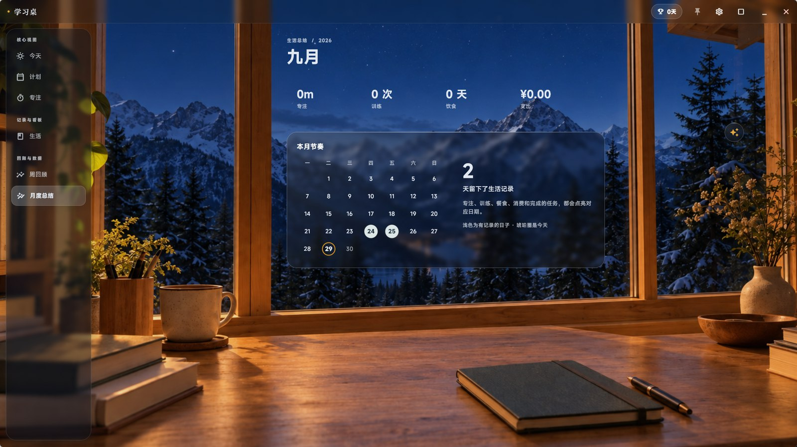
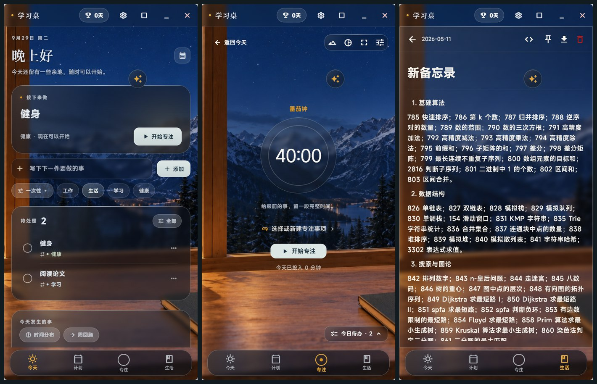

# 学习桌 · Todo — 待办 / 课程表 / 专注 / 生活记录

一款为**学生与自律党**打造的桌面学习伴侣：待办打卡、课程表、番茄钟、备忘录，加上健身、饮食、消费这些生活侧的记录，全部装进一个 Win / Android 双端应用。
它最特别的地方是**环境模式**——你的整个桌面悬浮在一张随时间变换的山间书桌照片上，所有面板都是真实玻璃质感。

## 🌟 特性一览

- 📋 **任务与习惯**：一次性任务 / 每日打卡 / 带截止时间（DDL）的任务，到期自动提醒、过期自动归档
- 📚 **课程表**：周计划视图 + 完整课表网格，支持从教务系统导出的 **.xlsx / .xls** 一键导入
- ⏱ **专注番茄钟**：可配置专注/休息节奏，**沉浸模式**全屏只剩计时器；专注数据自动生成时间分布
- 📝 **备忘录**：满宽阅读排版，学习笔记、灵感、清单都能放
- 🤖 **AI 助手**：接入 GLM / DeepSeek / Kimi / Qwen，读取你今天的任务、课程与训练给出建议——**上传哪些数据由你自己开关**
- 🏋️ **健身训练**：训练循环编排 + 人体肌群图谱，练了哪里一图看清
- 🥗 **饮食与减脂**：按餐次记录，内置 Mifflin-St Jeor 减脂目标计算（热量与三大营养素）
- 💰 **消费记录**：记一笔 / 导入微信支付账单，月度净支出与分类去向一目了然
- 📊 **回顾与统计**：连续打卡、近七天柱状图、GitHub 风格热力图、月度总结
- 🔔 **提醒体系**：Android 精确闹钟 + 通知渠道；Windows 托盘常驻、窗口置顶图钉、开机自启
- 🔄 **自动更新**：应用内检查新版本，安装包统一在 GitHub Releases 发布

## 🌅 环境模式：会呼吸的桌面

背景照片会跟随一天中的时刻自动切换，玻璃面板实时折射场景色彩；也可以固定某个场景，或换上你自己的照片，甚至指定文字颜色。

夜晚的书桌前，任务、日程和今天的时间轴尽收眼底：

偏好素雅？一键切回**纸面模式**——暖纸底色配墨蓝卡片，回到安静的工作台。

## 📚 课程表

先选一天，再看这一天的课程与安排；完整课表按周网格排布，今天一列高亮，再也不用担心走错教室。

## 🤖 AI 助手

悬浮球随时唤出毛玻璃对话面板。它读取的是**你勾选过的**今日数据（任务 / 课程 / 专注 / 训练 / 饮食 / 减脂目标），给出的建议落地可执行；API Key 只保存在本机。

## 🏋️ 健身 & 🥗 饮食

训练循环逐日安排动作，完成记录会点亮肌群图谱；饮食按早餐 / 午餐 / 晚餐 / 加餐记录，减脂计划按你的身体数据计算每日热量与蛋白质 / 脂肪 / 碳水目标。

| | |
| --- | --- |
|  |  |

## 📊 回顾与统计

周回顾把今日完成、近七天节奏和坚持足迹（GitHub 风格热力图）放在一屏；月末还有一本"生活告函"——杂志式排版的本月总结。

## 📱 Windows 与 Android

Windows 端免安装双击即用，可置顶、可最小到托盘；Android 端有桌面小组件和精确提醒，窄屏下自动切换单列布局。

### 💰 消费记录（细节向）

- 在"生活 → 消费记录"中快速记一笔，可填写日期、金额、分类、支付方式和备注，并可编辑或删除。
- 按月查看净支出、毛支出、退款及分类汇总。金额在数据库中以整数"分"保存。
- 可选择微信支付导出的**个人对账 CSV、XLSX 或 ZIP**，预览每笔交易、核对分类后再导入；相同交易单号会跳过。ZIP 如有密码，只用于本机解压本次文件。
- 退款会冲减净支出；转账、收入和充值等默认不计入消费，可在预览中自行选择。若格式无法识别，请先核对导出类型或使用解压后的 CSV。
- 当前没有付款后自动记账功能。已查到的微信支付官方账单 API 属于商户接口，未核实到适用于个人账单的授权同步接口；本应用不会要求微信支付密码，也不模拟登录或抓取私有数据。
- 账单只在本地处理，不上传服务器。

---

## 🚀 下载与安装

所有安装包统一在 [**Releases**](https://github.com/RJL816/TODOAPP/releases/latest) 页面发布：

| 平台 | 获取方式 |
| --- | --- |
| **Windows** | 下载最新 Release 中的 `todo_app_vX.X.X-windows.zip`，解压到任意位置，双击 `todo_app.exe` 即可，无需安装环境 |
| **Android** | 下载最新 Release 中的 `app-release.apk`，传到手机直接安装（如遇系统提示，请允许安装） |

已安装的用户：应用启动时会静默检查新版本，发现新版会弹提示，点击即可前往下载。

### 🛠️ 基本使用入门

- **添加任务**：在首页输入框写下要做的事，可选一次性 / 每日打卡 / 带截止时间，到点自动提醒。
- **导入课程**：切换到"计划"页 → 完整课表 → 课表管理，选择教务系统导出的 Excel 文件即可生成课表。
- **开始专注**：进入"专注"页选择专注事项，点"开始专注"；想不被打扰就打开右上角的沉浸模式。
- **记录生活**：在"生活"页记录想法、训练、饮食和花销；周末去"周回顾"看看自己的节奏。

### 📺 视频上手教程

[点击前往 B 站观看操作指南](https://www.bilibili.com/video/BV1p99yBYEcP?vd_source=391ef5a06586cdb72b7afc9fdad35b3b)
*(注：该视频录制偏早，尚未包含环境模式、AI 助手、健身饮食等新内容，欢迎直接下载体验！)*

---

如果你觉得这款应用对你有帮助，欢迎点亮右上角的 ⭐️ **Star** 鼓励一下作者！
使用过程中遇到任何问题，或对新功能有期望，也十分欢迎随时提交 [Issue](https://github.com/RJL816/TODOAPP/issues)。
