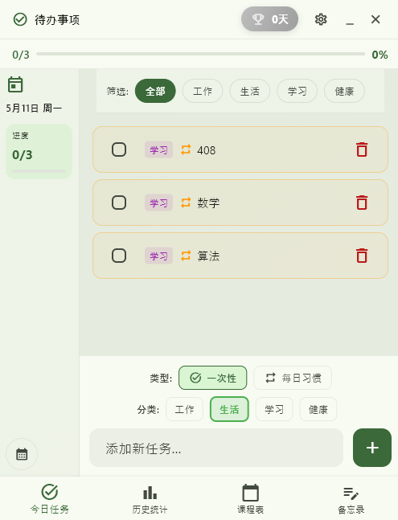
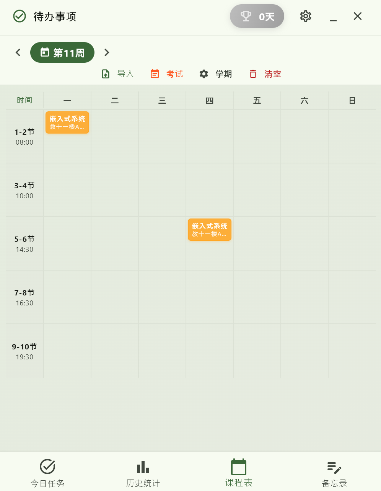
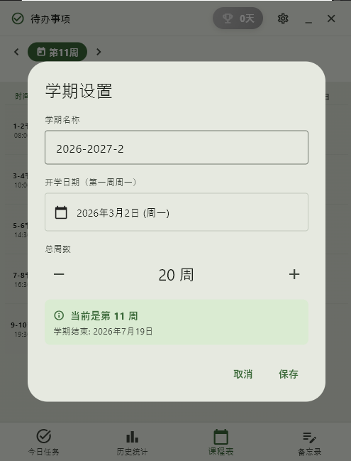
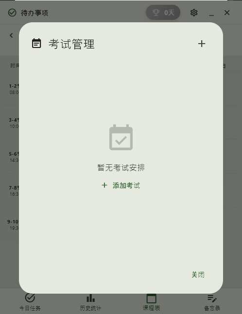
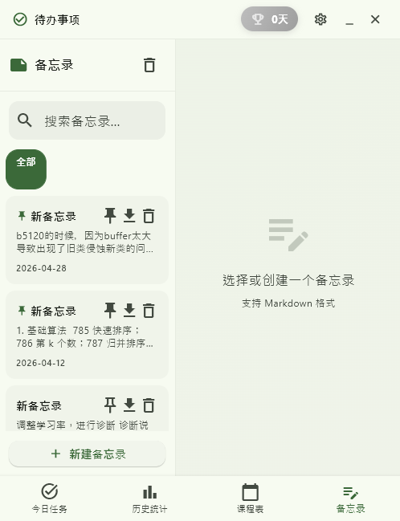
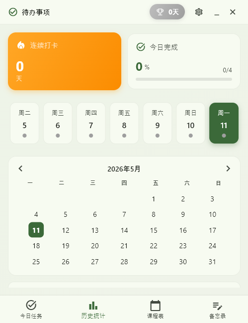

# 待办事项与课程表应用 (Todo App)

欢迎使用！这是一款集成了**目标打卡、日程管理、课程表和备忘录**的全能待办事项管理应用。
本应用支持 Windows 与 Android 双平台运行，并结合了奖励反馈机制，让你的学习与生活管理变得更加轻松有趣。

## 🌟 主要功能

### 📋 任务与习惯管理
- **一次性任务 (One-Time)**：适合临时安排的事情，完成后第二天自动隐藏。
- **每日打卡 (Recurring)**：适合习惯养成，每天自动重置并持续追踪。

### 📚 智能课程表
- 每日上课时间与教室地点一目了然，再也不用担心走错教室。
- 支持一键从 Excel (.xlsx) 文件导入教务系统标准课程表。

### 📝 灵感备忘录
- 方便快捷地记录日常灵感、学习重点笔记或购物清单。

### 💰 消费记录
- 在“更多 → 消费记录”中快速记一笔，可填写日期、金额、分类、支付方式和备注，并可编辑或删除。
- 按月查看净支出、毛支出、退款及分类汇总。金额在数据库中以整数“分”保存。
- 可选择微信支付导出的**个人对账 CSV、XLSX 或 ZIP**，预览每笔交易、核对分类后再导入；相同交易单号会跳过。ZIP 如有密码，只用于本机解压本次文件。
- 退款会冲减净支出；转账、收入和充值等默认不计入消费，可在预览中自行选择。若格式无法识别，请先核对导出类型或使用解压后的 CSV。
- 当前没有付款后自动记账功能。已查到的微信支付官方账单 API 属于商户接口，未核实到适用于个人账单的授权同步接口；本应用不会要求微信支付密码，也不模拟登录或抓取私有数据。
### 🎮 游戏化体验与数据统计
- **热力图展示**：像 GitHub 提交记录一样，直观浏览过去每个月的打卡活跃度。
- **连续打卡里程碑**：统计你的连续完成天数，见证你的每一次坚持。
- **撒花庆祝动画**：完成当天所有待办后，满屏撒花，给予满满成就感。
- **音效提示**：任务勾选时伴随清脆提示音，获得正向反馈！

### 📱 多客户端支持
- **Windows PC 端**：无需安装环境，双击直接运行。
- **Android 移动端**：随时随地查看，添加了桌面桌面小组件 (Widget) 支持，免开应用洞悉进度。

---

## 🚀 下载与安装

### Windows 端
1. 下载本仓库中最新版本的解压包（如 todo_app_v5.zip ) 或直接下载仓库中的 todo_app_v5 文件夹。
2. 放在你喜欢的位置，直接双击运行文件夹内的 todo_app.exe 即可使用！

### Android 端
1. 找到仓库目录下最新的 APK 安装包（例如 app_v7.apk 或其他最新版本）。
2. 下载到手机上，点击安装（如遇手机系统提示，请允许安装）。
3. **视频上手教程**：[点击前往B站观看操作指南](https://www.bilibili.com/video/BV1p99yBYEcP?vd_source=391ef5a06586cdb72b7afc9fdad35b3b)  
   *(注：该视频内容录制偏早，尚未包括现版本的“备忘录”和高级“热力图”等内容，欢迎你亲自下载体验！)*

---

## 🛠️ 基本使用入门

- **添加任务**：点击首页“+”加号，设定标题描述，并确立是一次性解决还是每天都要做。
- **导入课程**：切换至“课程表”页面，点击导入，选择设备里的 Excel 文件，系统即可智能提取排期生成日历。
- **打卡复盘**：点击底部右侧按钮进入“统计”页面，纵观你的历史成果与努力数据。

---

如果你觉得这款应用对你有帮助，欢迎点亮右上角的 ⭐️ **Star** 鼓励一下作者！
使用过程中遇到任何问题，或对新功能有期望，也十分欢迎随时提交 [Issue](https://github.com/RJL816/TODOAPP/issues)。
